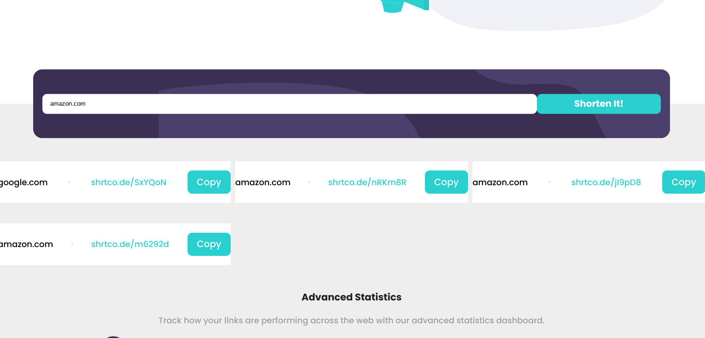
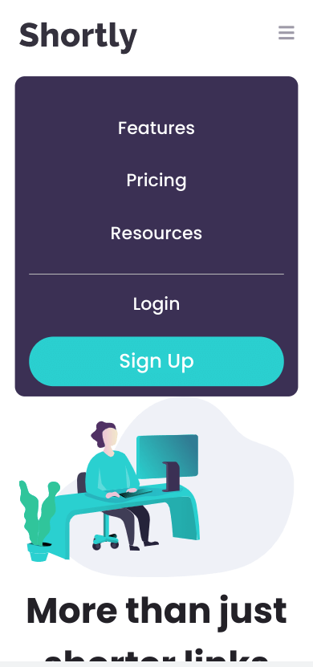

# Frontend Mentor - Shortly URL shortening API Challenge solution

This is a solution to the [Shortly URL shortening API Challenge challenge on Frontend Mentor](https://www.frontendmentor.io/challenges/url-shortening-api-landing-page-2ce3ob-G). Frontend Mentor challenges help you improve your coding skills by building realistic projects. 

## Table of contents

- [Overview](#overview)
  - [The challenge](#the-challenge)
  - [Screenshot](#screenshot)
  - [Links](#links)
- [My process](#my-process)
  - [Built with](#built-with)
  - [What I learned](#what-i-learned)
  - [Continued development](#continued-development)
  - [Useful resources](#useful-resources)

## Overview

### The challenge

Users should be able to:

- View the optimal layout for the site depending on their device's screen size
- Shorten any valid URL
- See a list of their shortened links, even after refreshing the browser
- Copy the shortened link to their clipboard in a single click
- Receive an error message when the `form` is submitted if:
  - The `input` field is empty

### Screenshot

### Links

- Live Site URL: [Github Pages](https://jdegand.github.io/url-shortening-api-landing-page/)

## My process

### Built with

- Semantic HTML5 markup
- CSS custom properties
- Flexbox
- CSS Grid

### What I learned

### Continued development

- Used empty li items to approximate look vs redoing html and the css problems that would follow.
- Missed putting a main tag.  So many wrapper divs...
- The api is very slow. 
- The mobile nav pushes down the content versus being positioned on top of it. 
- The links are added into a grid. 
- Use Clipboard API or Clipboard JS.
- Used CSS filter vs svg in the html instead.
- The hover color on the icons is too dark.

### Useful resources

- [Shrt Code](https://shrtco.de/)
- [MDN Docs](https://developer.mozilla.org/en-US/docs/Web/API/Fetch_API) - Fetch Api
- [MDN Docs](https://developer.mozilla.org/en-US/docs/Web/API/Document/execCommand) - execCommand
- [MDN Docs](https://developer.mozilla.org/en-US/docs/Mozilla/Add-ons/WebExtensions/Interact_with_the_clipboard) - Clipboard
- [Clipboard JS](https://clipboardjs.com/)
- [Codepen](https://codepen.io/sosuke/pen/Pjoqqp) - CSS filter generator
